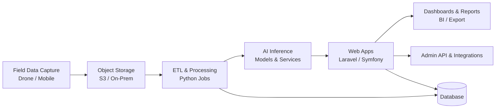

## Hi, I'm Muhamad Arwin Wijaya 👋

**Solution Engineer Analyst at Great Giant Foods**  
Building AI-driven web systems, cloud platforms, and automation to deliver real operational impact.

---

## 📌 Highlights
- **AI:** Applied AI for agriculture (Drone AI, counting, sizing, early warning) with real-world constraints.
- **DevOps:** Shipping containerized web apps with CI/CD, cloud & on-prem deployment.
- **Product:** Turning raw field data into dashboards, insights, and decision support.

---

## 🔧 What I work on
- 🌱 **AI for Agriculture** — Drone AI, Counting, Sizing, Early Warning  
- 🧠 **Data & Machine Learning** — Python, XGBoost, Analytics  
- ☁️ **Cloud & DevOps** — AWS, Docker, CI/CD  
- 🖥️ **Web Applications** — Laravel, Symfony, REST APIs  

---

## 📈 Activity
**What it shows:** consistency and delivery cadence across projects.

<table align="center">
  <tr>
    <td colspan="2" align="center"></td>
  </tr>
  <tr>
    <td colspan="2" align="center"></td>
  </tr>
  <tr>
    <td colspan="2" align="center"></td>
  </tr>
</table>

  

  

---

## ⚙️ DevOps & Engineering
**What it shows:** engineering footprint and languages used in production work.

**Core Tech Stack**

---

## 🏗️ Architecture (High-level)
**What it shows:** end-to-end flow from data capture to insight delivery.

---

## 🤖 AI (Applied)
**What it shows:** focus on usable metrics and operational stability, not just model scores.

- Business-relevant evaluation (Accuracy, MAE/MAPE, ROC-AUC)
- Deployment readiness, monitoring, and iteration
- Integration with web dashboards for decision support

---

## 🚀 Current Focus
- Scaling AI web applications for production environments  
- Improving data pipelines, reliability, and observability  
- Bridging AI models with real business use cases  

---

## 📫 Reach me
- **LinkedIn:** https://www.linkedin.com/in/muhamadarwinwijaya/
- **Portfolio:** https://marwinwijaya.github.io
